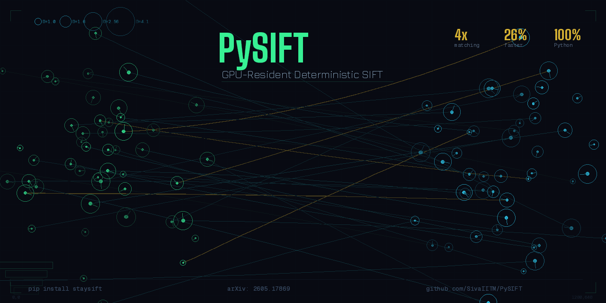

 
# PySIFT

**GPU-Resident Deterministic SIFT for Deep Learning Vision Pipelines - PySIFT**

[](https://www.python.org/downloads/)
[](LICENSE)
[](https://developer.nvidia.com/cuda-toolkit)
[](https://arxiv.org/abs/2605.17869)
[](https://www.kaggle.com/code/sivakumarksce24d040/pysift-tutorial)
[](https://www.kaggle.com/code/sivakumarksce24d040/pysift-determinism)
[](https://huggingface.co/spaces/sivaIITM/PySIFT)
[](https://pysift.readthedocs.io/en/latest/)
[](https://sivaiitm.github.io/PySIFT/)

**PySIFT** is a pure-Python, open-source GPU-resident implementation of the Scale-Invariant Feature Transform (SIFT) built on CuPy and Numba CUDA kernels which is faster and yet more accurate. It runs the entire detection-to-descriptor pipeline on your NVIDIA GPU with zero-copy DLPack interop to PyTorch so that your downstream DL steps will be free from CPU PCIe bottlenecks.

## Architecture

<p align="center">
  
</p>

## Key Features of PySIFT

- **GPU-resident pipeline** -- Detection, description, matching, RANSAC, and blending all execute on the GPU via CuPy + Numba CUDA kernels
- **Zero-copy DLPack handoff** -- CuPy arrays pass to PyTorch tensors without memory copies, enabling seamless integration with deep learning pipelines
- **OpenCV-accurate** -- Numerically equivalent to OpenCV SIFT (Lowe 2004), verified across HPatches, Oxford 5K, IMC Phototourism, and MegaDepth-1500
- **Modular descriptor/matcher backends** -- Swap in HardNet, HyNet (learned descriptors) or LightGlue (learned matching) with a single config flag
- **Deterministic** -- Bitwise reproducible results via warp-shuffle reductions (no atomicAdd non-determinism)

## Qualitative Results of PySIFT

<p align="center">
  
</p>

## Installation of PySIFT

### Prerequisites: CUDA dependencies

PySIFT requires an NVIDIA GPU with CUDA. Two dependencies must be installed manually because they are CUDA-version-specific:

```bash
# Check your CUDA version
nvcc --version

# 1. Install CuPy (pick ONE matching your CUDA version)
pip install cupy-cuda12x   # CUDA 12.x
pip install cupy-cuda11x   # CUDA 11.x

# 2. Install PyTorch with CUDA (default pip installs CPU-only!)
pip install torch --index-url https://download.pytorch.org/whl/cu124   # CUDA 12.4
pip install torch --index-url https://download.pytorch.org/whl/cu121   # CUDA 12.1
pip install torch --index-url https://download.pytorch.org/whl/cu118   # CUDA 11.8
```

> **Important:** Both CuPy and PyTorch-CUDA are required runtime dependencies but cannot be auto-installed by pip because the correct package varies by CUDA version. Install them before installing PySIFT.

### Install PySIFT

```bash
# From PyPI
pip install staysift

# Or from GitHub
pip install git+https://github.com/SivaIITM/PySIFT.git

# Or from source
git clone https://github.com/SivaIITM/PySIFT.git
cd PySIFT
pip install -e .
```

### Full install (all dependencies at once)

```bash
pip install cupy-cuda12x   # or cupy-cuda11x
pip install -r requirements.txt
pip install git+https://github.com/SivaIITM/PySIFT.git
```

### Recommended: depth-aware stitching

PySIFT uses MiDaS monocular depth estimation to split inliers into depth bands, giving each band its own homography. This significantly improves stitching quality for scenes with foreground/background parallax. Without `timm`, stitching falls back to a single global homography.

```bash
pip install timm>=0.9
```

### Optional dependencies

```bash
# Learned descriptors (HardNet, HyNet, OriNet)
pip install kornia

# YAML config file support
pip install pyyaml

# Or install all optional deps at once
pip install -e ".[all]"
```

## Quick Start

### Python API

```python
import cv2
from pysift import PySIFT, GPUPyStitch

# Feature extraction (input: grayscale numpy array)
gray = cv2.imread("image.jpg", cv2.IMREAD_GRAYSCALE)
sift = PySIFT()
keypoints, descriptors = sift.detectAndCompute(gray)

# Panoramic stitching (input: BGR numpy arrays, not file paths)
img1 = cv2.imread("left.jpg")
img2 = cv2.imread("right.jpg")
stitcher = GPUPyStitch()
panorama = stitcher.stitch(img1, img2)
```

### CLI

```bash
# Basic stitching
pysift-stitch left.jpg right.jpg

# 3-image panorama with output directory
pysift-stitch left.jpg center.jpg right.jpg -o results/

# With config file
pysift-stitch left.jpg right.jpg --config config.yaml

# Learned pipeline
pysift-stitch left.jpg right.jpg --descriptor hardnet --matcher lightglue
```

## Configuration Presets

| Preset | Orientation | Descriptor | Matcher | Use Case |
|--------|-------------|------------|---------|----------|
| **Classic** | histogram | sift | ratio | Fastest. Full Lowe 2004 pipeline |
| **Modern** | histogram | sift | lightglue | Best accuracy with proven detection |
| **Learned** | orinet | hardnet | lightglue | Fully modern pipeline |
| **Mobile** | histogram | sift | ratio | Large phone images (auto-resize + denoise) |

See [`config.yaml`](config.yaml) for all parameters and presets.

## Requirements

### Hardware
- NVIDIA GPU with CUDA support (tested on RTX 3050 4GB and above)
- CUDA Toolkit 11.x or 12.x

### Software

| Package | Version | Purpose |
|---------|---------|---------|
| Python | >= 3.9 | Runtime |
| PyTorch | >= 2.0 | Tensor ops, SVD, CUDA graphs |
| CuPy | >= 12.0 | GPU arrays, CUDA kernels |
| Numba | >= 0.57 | JIT-compiled CUDA kernels |
| NumPy | >= 1.22 | CPU array operations |
| OpenCV | >= 4.5 | Image I/O, CLAHE |
| kornia | >= 0.7 | *Optional:* HardNet, HyNet, OriNet |
| timm | >= 0.9 | *Optional:* MiDaS depth estimation |
| PyYAML | any | *Optional:* config file support |

## Who is PySIFT For?

- **Medical imaging** -- Register histopathology slides, align retinal scans. No retraining needed. Deterministic output for regulatory compliance.
- **Drone / UAV** -- Real-time aerial stitching on 4 GB GPUs (Jetson Orin compatible). DSP-SIFT handles altitude-varying scale changes.
- **SLAM & robotics** -- GPU-resident features with zero-copy DLPack handoff to your visual odometry pipeline. Deterministic = repeatable grasps.
- **3D reconstruction** -- Drop-in replacement for COLMAP's CPU SIFT. GPU-resident features for NeRF / 3DGS / SfM preprocessing.
- **Satellite & remote sensing** -- Gigapixel mosaics. Speed advantage grows with resolution (3.2x faster at 4K). Domain-agnostic across spectral bands.

## Resources

| Resource | Link |
|----------|------|
| arXiv Paper | [arxiv.org/abs/2605.17869](https://arxiv.org/abs/2605.17869) |
| Documentation | [pysift.readthedocs.io](https://pysift.readthedocs.io/) |
| Interactive Tutorial | [sivaiitm.github.io/PySIFT](https://sivaiitm.github.io/PySIFT/) |
| HuggingFace Space | [huggingface.co/spaces/sivaIITM/PySIFT](https://huggingface.co/spaces/sivaIITM/PySIFT) |
| Kaggle Competition | [IMC 2026 Warm-Up Sprint](https://www.kaggle.com/competitions/imc-2026-warm-up-landmark-matching-sprint) |
| PyPI Package | [pypi.org/project/staysift](https://pypi.org/project/staysift/) |

## Citation

**Paper**: [arXiv:2605.17869](https://arxiv.org/abs/2605.17869)

```bibtex
@article{sivakumar2026pysift,
  title   = {PySIFT: GPU-Resident Deterministic SIFT for Deep Learning Vision Pipelines},
  author  = {Sivakumar, K.S.},
  journal = {arXiv preprint arXiv:2605.17869},
  year    = {2026}
}
```

## License

This project is licensed under the MIT License -- see the [LICENSE](LICENSE) file for details.
