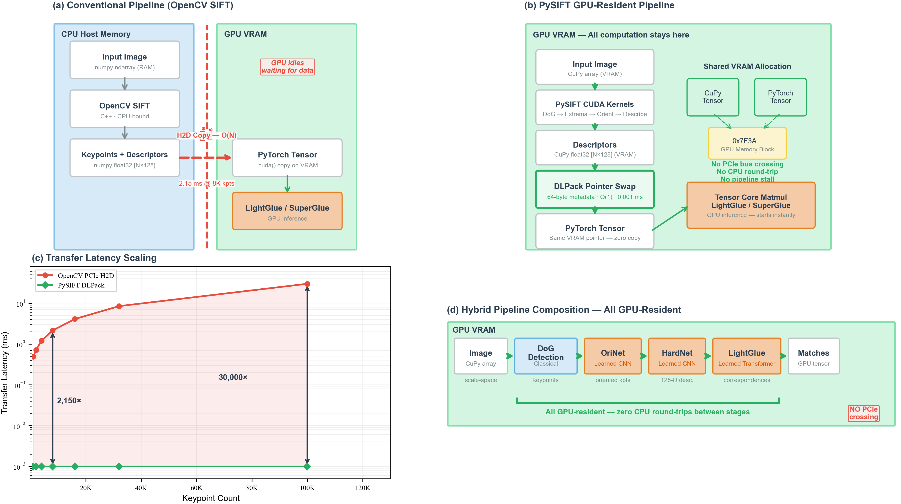
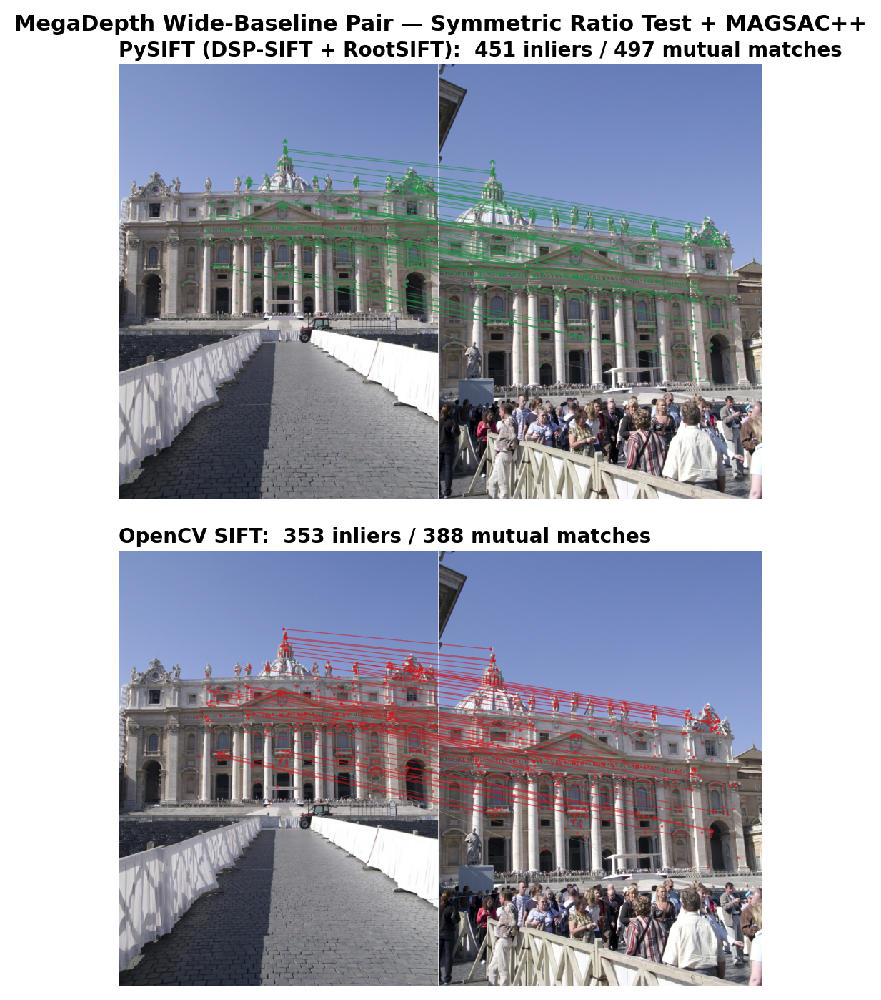

# PySIFT

**GPU-Resident Deterministic SIFT for Deep Learning Vision Pipelines**

[](https://www.python.org/downloads/)
[](LICENSE)
[](https://developer.nvidia.com/cuda-toolkit)

A pure-Python, GPU-resident SIFT implementation that matches OpenCV SIFT accuracy while running **26% faster end-to-end** with **4x matching speedup**. Zero-copy DLPack interop keeps tensors on the GPU across the full pipeline -- no PCIe round-trips.

## Architecture

<p align="center">
  
</p>

## Key Features

- **GPU-resident pipeline** -- Detection, description, matching, RANSAC, and blending all execute on the GPU via CuPy + Numba CUDA kernels
- **Zero-copy DLPack handoff** -- CuPy arrays pass to PyTorch tensors without memory copies, enabling seamless integration with deep learning pipelines
- **OpenCV-accurate** -- Numerically equivalent to OpenCV SIFT (Lowe 2004), verified across HPatches, Oxford 5K, IMC Phototourism, and MegaDepth-1500
- **Modular descriptor/matcher backends** -- Swap in HardNet, HyNet (learned descriptors) or LightGlue (learned matching) with a single config flag
- **Deterministic** -- Bitwise reproducible results via warp-shuffle reductions (no atomicAdd non-determinism)

## Qualitative Results

<p align="center">
  
</p>

## Installation

### From GitHub (private repo)

```bash
pip install git+https://github.com/<your-username>/PySIFT.git
```

### From source

```bash
git clone https://github.com/<your-username>/PySIFT.git
cd PySIFT
pip install -e .
```

### Optional dependencies

```bash
# Learned descriptors (HardNet, HyNet, OriNet)
pip install kornia

# MiDaS depth estimation for depth-aware stitching
pip install timm

# YAML config file support
pip install pyyaml

# Install everything
pip install -e ".[all]"
```

> **Note:** CuPy must be installed separately matching your CUDA version:
> ```bash
> pip install cupy-cuda12x   # CUDA 12.x
> pip install cupy-cuda11x   # CUDA 11.x
> ```

## Quick Start

### Python API

```python
from pysift import PySIFT, GPUPyStitch

# Feature extraction
sift = PySIFT()
keypoints, descriptors = sift.detectAndCompute(gray_image)

# Panoramic stitching (2 or 3 images)
stitcher = GPUPyStitch()
panorama = stitcher.stitch(img_left, img_right)
```

### CLI

```bash
# Basic stitching
pysift-stitch left.jpg right.jpg

# 3-image panorama with output directory
pysift-stitch left.jpg center.jpg right.jpg -o results/

# With config file
pysift-stitch left.jpg right.jpg --config config.yaml

# Learned pipeline
pysift-stitch left.jpg right.jpg --descriptor hardnet --matcher lightglue
```

## Configuration Presets

| Preset | Orientation | Descriptor | Matcher | Use Case |
|--------|-------------|------------|---------|----------|
| **Classic** | histogram | sift | ratio | Fastest. Full Lowe 2004 pipeline |
| **Modern** | histogram | sift | lightglue | Best accuracy with proven detection |
| **Learned** | orinet | hardnet | lightglue | Fully modern pipeline |
| **Mobile** | histogram | sift | ratio | Large phone images (auto-resize + denoise) |

See [`config.yaml`](config.yaml) for all parameters and presets.

## Requirements

### Hardware
- NVIDIA GPU with CUDA support (tested on RTX 3050 4GB and above)
- CUDA Toolkit 11.x or 12.x

### Software

| Package | Version | Purpose |
|---------|---------|---------|
| Python | >= 3.9 | Runtime |
| PyTorch | >= 2.0 | Tensor ops, SVD, CUDA graphs |
| CuPy | >= 12.0 | GPU arrays, CUDA kernels |
| Numba | >= 0.57 | JIT-compiled CUDA kernels |
| NumPy | >= 1.22 | CPU array operations |
| OpenCV | >= 4.5 | Image I/O, CLAHE |
| kornia | >= 0.7 | *Optional:* HardNet, HyNet, OriNet |
| timm | >= 0.9 | *Optional:* MiDaS depth estimation |
| PyYAML | any | *Optional:* config file support |

## Citation

```bibtex
@article{sivakumar2026pysift,
  title   = {PySIFT: GPU-Resident Deterministic SIFT for Deep Learning Vision Pipelines},
  author  = {Sivakumar, K.S.},
  journal = {arXiv preprint},
  year    = {2026}
}
```

## License

This project is licensed under the MIT License -- see the [LICENSE](LICENSE) file for details.
