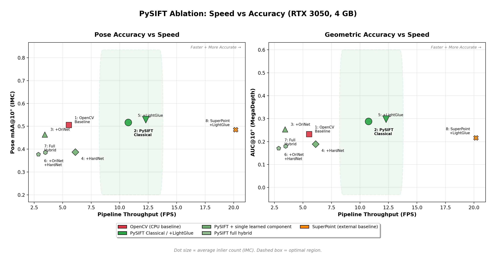

# Pre-computed Results

Aggregate benchmark metrics from PySIFT evaluation. These reproduce the paper's claims without requiring dataset downloads or GPU compute.

## Contents

| File | Description |
|------|-------------|
| `summary.csv` | All 8 ablation configs: key metrics in machine-readable format |
| `fig_pareto_ablation.png` | Speed vs accuracy Pareto plot (reproduces Table 3 visually) |
| `fig_pareto_ablation.pdf` | Vector version for print/slides |
| `../determinism_reference/` | Bitwise-reproducible keypoint/descriptor dumps for verification |

## Pareto Plot

<p align="center">
  
</p>

PySIFT Classical (Config 2) and PySIFT + LightGlue (Config 5) occupy the Pareto-optimal region: highest accuracy at highest throughput. SuperPoint is faster but produces 2x fewer inliers. Fully-learned hybrids (Configs 6-7) degrade both speed and accuracy.

## Quick Verification

```python
import pandas as pd

df = pd.read_csv("summary.csv")

# Paper claim: PySIFT 47.5% more inliers than OpenCV on IMC
opencv = df[df.config == "1_opencv_baseline"].imc_avg_inliers.values[0]
pysift = df[df.config == "2_pysift_classical"].imc_avg_inliers.values[0]
print(f"Inlier gain: {(pysift/opencv - 1)*100:.1f}%")  # 47.5%

# Paper claim: 94% faster pipeline
opencv_fps = df[df.config == "1_opencv_baseline"].imc_fps.values[0]
pysift_fps = df[df.config == "2_pysift_classical"].imc_fps.values[0]
print(f"FPS gain: {(pysift_fps/opencv_fps - 1)*100:.1f}%")  # 93.9%
```

## Determinism Verification

The `determinism_reference/` folder contains `.npz` files with keypoints and descriptors extracted from representative images across HPatches, IMC, and ROxford5K. Run the included test to verify bitwise reproducibility:

```bash
python tests/quick_smoke_test.py
```

## Hardware

All results measured on:
- **GPU**: NVIDIA GeForce RTX 3050 Laptop GPU (4 GB VRAM)
- **CUDA**: 12.4
- **Driver**: 572.83
- **OS**: Windows 11
